<div align="center">

# 🚀 ResumeAI Pro

### AI-Powered Resume Analyzer & Career Intelligence Platform

### *Analyze • Optimize • Get Hired*

[](https://resumeai-pro.streamlit.app/)


</div>

---

# 🌟 Overview

ResumeAI Pro is an AI-powered Resume Analysis platform that evaluates resumes against job descriptions using Google's Gemini AI.

Instead of providing only an ATS score, ResumeAI Pro performs a recruiter-level evaluation of resumes and generates intelligent career insights to improve hiring potential.

The platform combines modern Artificial Intelligence with interactive analytics to help job seekers build stronger resumes, prepare for interviews, and maximize their chances of landing interviews.

---

# 🌐 Live Demo

### 🚀 ResumeAI Pro

https://resumeai-pro.streamlit.app/

---

# ✨ Features

## 📄 Resume Analysis

- ATS Resume Score
- Resume Health Dashboard
- AI Executive Summary
- Job Match Percentage
- Hiring Recommendation
- Resume Quality Evaluation

---

## 🤖 AI Resume Studio

- AI Resume Rewriter
- ATS Optimization
- Resume Comparison
- Professional Resume Builder
- Resume PDF Export

---

## 💌 AI Career Assistant

- AI Cover Letter Generator
- AI Interview Coach
- Recruiter Dashboard
- Salary Prediction
- Interview Probability
- Offer Probability

---

## 📊 Visual Analytics

- ATS Gauge
- AI Skill Radar
- Skill Match Dashboard
- Resume Health Dashboard
- Recruiter Decision Dashboard

---

# 🛠 Tech Stack

| Category | Technology |
|------------|-------------------------|
| Language | Python |
| Framework | Streamlit |
| AI Model | Google Gemini 2.5 Flash |
| Charts | Plotly |
| Gauge Charts | Streamlit ECharts |
| PDF Generator | ReportLab |
| Resume Parser | PyPDF2 |
| Styling | CSS |
| Version Control | Git & GitHub |
| Deployment | Streamlit Community Cloud |
# 📸 Application Preview

> Below are some screenshots showcasing ResumeAI Pro in action.

---

## 🏠 Home Page

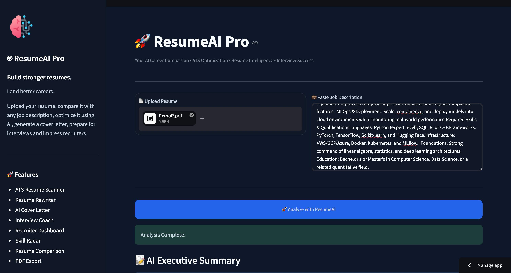

---

## 📝 AI Executive Summary

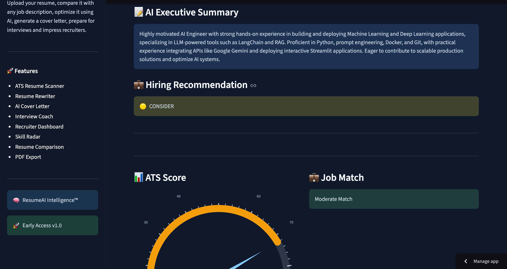

---

## 📊 ATS Score Analysis

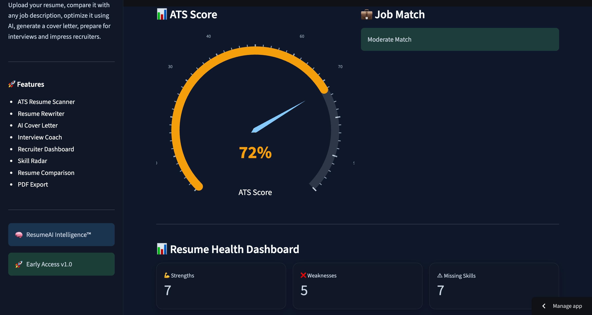

---

## 📈 Resume Health Dashboard

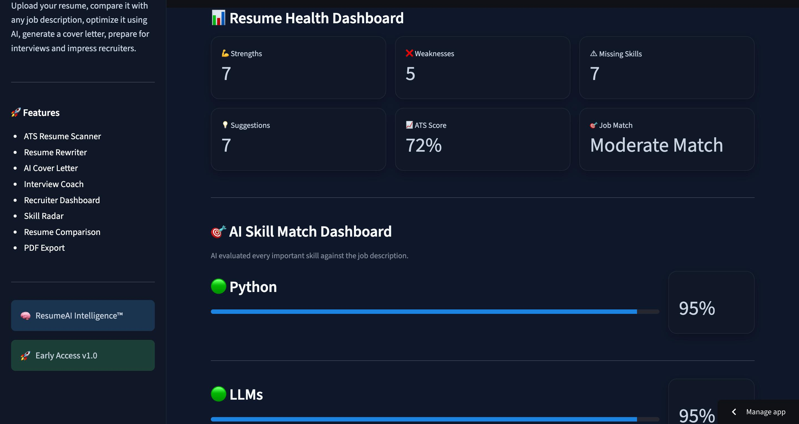

---

## 🎯 AI Skill Radar

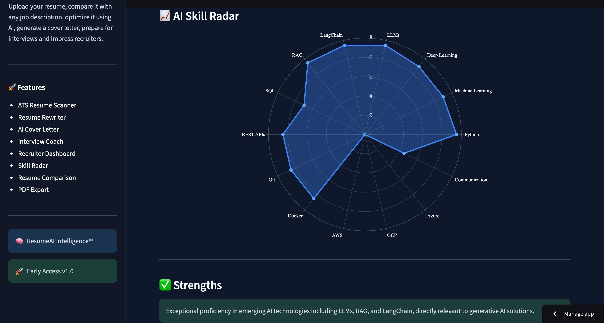

---

## 🔄 Resume Before vs After

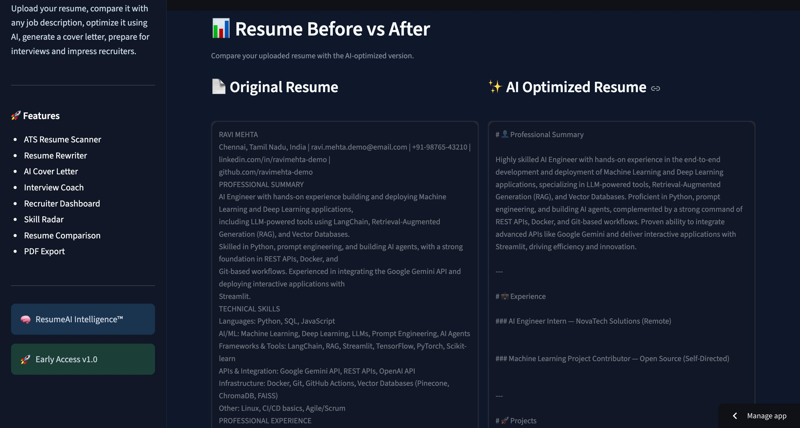

---

## ✨ AI Resume Studio

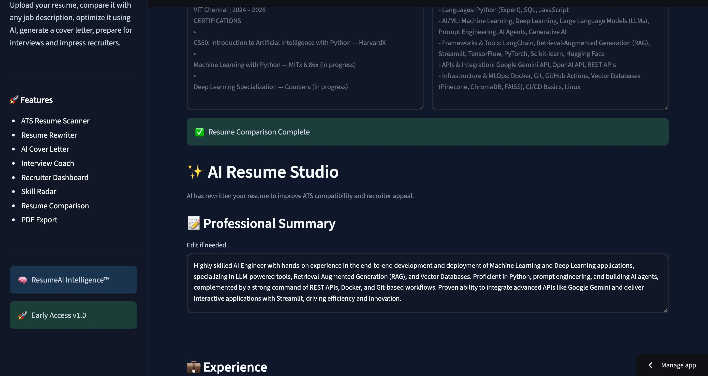

---

## 💌 AI Cover Letter Generator

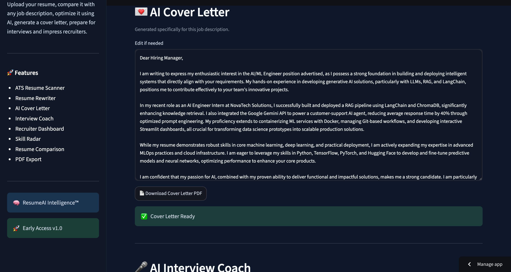

---

## 🎤 AI Interview Coach

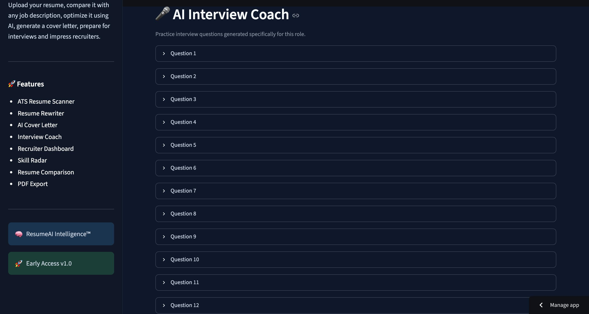

---

## 📋 Intelligent Dashboard

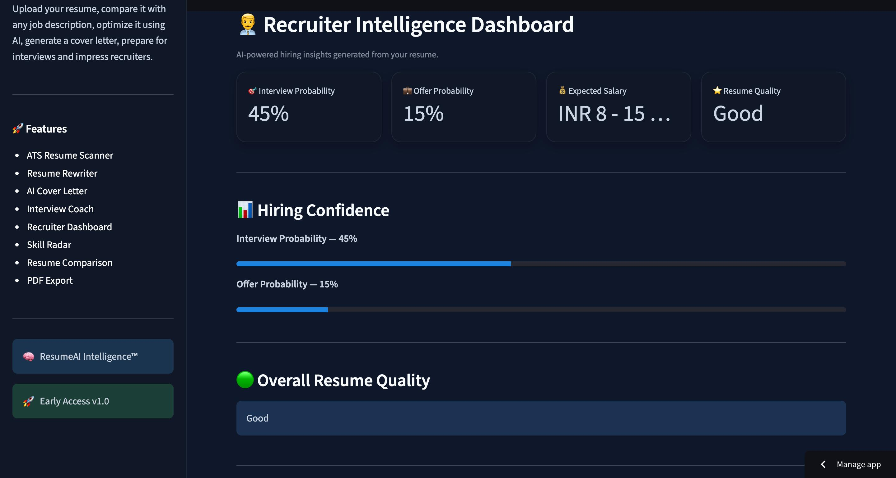

---

## 🤖 Recruiter Decision Dashboard

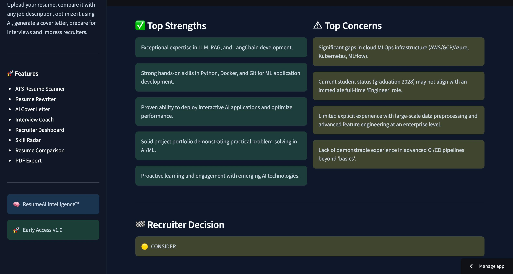

---

# 🧠 How ResumeAI Pro Works

```text
                 Resume Upload
                       │
                       ▼
          PDF Text Extraction (PyPDF2)
                       │
                       ▼
            Job Description Input
                       │
                       ▼
            Google Gemini AI Analysis
                       │
        ┌──────────────┼──────────────┐
        ▼              ▼              ▼
   ATS Analysis   Resume Rewrite   Skill Analysis
        │              │              │
        └──────────────┼──────────────┘
                       ▼
          Cover Letter Generation
                       │
                       ▼
         Interview Question Generator
                       │
                       ▼
          Recruiter Decision Dashboard
                       │
                       ▼
              Download Optimized PDFs
```

---

# 📂 Project Structure

```text
AI-Resume-Analyzer/
│
├── app.py
├── requirements.txt
├── README.md
├── .gitignore
├── .env
│
├── assets/
│   ├── style.css
│   └── screenshots/
│       ├── 01-home.jpeg
│       ├── 02-ai-executive-summary.jpeg
│       ├── 03-ats-score.jpeg
│       ├── 04-health-dashboard.jpeg
│       ├── 05-ai-radar.jpeg
│       ├── 06-before-vs-after.jpeg
│       ├── 07-ai-resume-studio.jpeg
│       ├── 08-ai-cover-letter.jpeg
│       ├── 09-ai-interview-coach.jpeg
│       ├── 10-intelligent-dashboard.jpeg
│       └── 11-recruiter-decision.jpeg
│
├── utils/
│   ├── components/
│   ├── pdf/
│   ├── gemini_client.py
│   ├── pdf_reader.py
│   └── format_resume.py
│
└── reports/
```

---

# ⭐ Key Highlights

- 🤖 AI-powered Resume Analyzer
- 📄 ATS Resume Scanner
- ✨ Resume Rewriter
- 📊 Interactive Analytics
- 🎯 Skill Gap Analysis
- 💌 AI Cover Letter Generator
- 🎤 AI Interview Coach
- 📈 Recruiter Dashboard
- 📄 PDF Resume Export
- 🌐 Streamlit Deployment
- 📱 Responsive User Interface
- ⚡ Fast AI Analysis
# ⚙️ Installation

## 1️⃣ Clone the Repository

```bash
git clone https://github.com/AKCHAUHAN247/AI-Resume-Analyzer.git
```

Move into the project folder.

```bash
cd AI-Resume-Analyzer
```

---

## 2️⃣ Install Dependencies

```bash
pip install -r requirements.txt
```

---

## 3️⃣ Configure Environment Variables

Create a file named:

```text
.env
```

Add your Gemini API Key:

```env
GEMINI_API_KEY=YOUR_API_Key_Here
```

---

## 4️⃣ Run the Application

```bash
streamlit run app.py
```

The application will automatically launch in your browser.

---

# 🚀 Deployment

ResumeAI Pro is deployed using **Streamlit Community Cloud**.

Deployment Steps:

- Push your project to GitHub
- Connect your GitHub repository with Streamlit Community Cloud
- Add the environment variable:
  - `GEMINI_API_KEY`
- Deploy
- Share the public URL

Live Application:

> https://resumeai-pro.streamlit.app/

---

# 💻 Technology Stack

### Frontend

- Streamlit
- HTML Components
- CSS
- Responsive Layout

### Backend

- Python

### Artificial Intelligence

- Google Gemini 2.5 Flash

### Data Processing

- JSON
- PyPDF2

### PDF Generation

- ReportLab

### Charts & Visualizations

- Plotly
- Streamlit ECharts

### Version Control

- Git
- GitHub

### Deployment

- Streamlit Community Cloud

---

# 🎯 How to Use

### Step 1

Upload your Resume in PDF format.

---

### Step 2

Paste the Job Description.

---

### Step 3

Click

```
🚀 Analyze with ResumeAI
```

---

### Step 4

ResumeAI performs an intelligent AI analysis and generates:

- ATS Score
- Resume Summary
- Resume Health Dashboard
- Missing Skills
- Resume Rewrite
- Resume Comparison
- Cover Letter
- Interview Questions
- Recruiter Dashboard

---

### Step 5

Download your optimized Resume and Cover Letter as PDF.

---

# 📊 Modules Included

✔ ATS Resume Analyzer

✔ Resume Health Dashboard

✔ AI Executive Summary

✔ Resume Comparison

✔ Resume Rewriter

✔ AI Cover Letter

✔ AI Interview Coach

✔ Skill Radar

✔ Skill Match Dashboard

✔ Recruiter Dashboard

✔ PDF Export

---

# 🚀 Future Roadmap

The next versions of ResumeAI Pro are planned to include:

- 🔐 User Authentication
- ☁️ Cloud Resume Storage
- 📂 Resume History
- 🌍 Multi-language Resume Support
- 🎙️ Voice-based Interview Practice
- 🤖 AI Portfolio Generator
- 💼 LinkedIn Profile Analyzer
- 📈 Resume Ranking Against Applicants
- 📱 Android Application
- 🍎 iOS Application
- 🌐 Custom Domain Deployment
- 🧠 Multi-LLM Support (Gemini, OpenAI, Claude)

---

# ⭐ Why ResumeAI Pro?

Unlike traditional ATS checkers, ResumeAI Pro combines AI-powered analysis, recruiter insights, resume rewriting, cover letter generation, interview preparation, and interactive analytics into a single platform.

It is designed to help students, fresh graduates, and professionals improve their resumes and increase their chances of getting shortlisted for interviews.
---

# 🤝 Contributing

Contributions are always welcome!

If you have ideas to improve ResumeAI Pro, feel free to:

1. Fork the repository
2. Create a new feature branch
3. Commit your changes
4. Push to your branch
5. Open a Pull Request

Every contribution—big or small—is appreciated.

---

# 🐛 Report Issues

Found a bug or have a feature request?

Please open an Issue on GitHub.

Feedback and suggestions are always welcome.

---

# 📜 License

This project is licensed under the **MIT License**.

You are free to use, modify, and distribute this project while providing appropriate credit.

---

# 👨‍💻 Developer

<div align="center">

## Akram Chauhan

**B.Tech — Computer Science & Engineering (AI & ML)**

**VIT Chennai**

Building AI-powered applications that solve real-world problems.

</div>

---

## 🌐 Connect with Me

### 💼 LinkedIn

https://www.linkedin.com/in/akram-chauhan/

---

### 🚀 Live Demo

https://resumeai-pro.streamlit.app/

---

### 📂 GitHub Repository

> Replace this with your repository link after pushing:

```
https://github.com/AKCHAUHAN247/AI-Resume-Analyzer
```

---

# ⭐ If You Like This Project

If ResumeAI Pro helped you or inspired you,

please consider:

⭐ Starring the repository

🍴 Forking the project

🛠 Contributing

📢 Sharing it with others

Your support motivates future development.

---

# 🏆 Project Highlights

✅ AI-Powered Resume Analysis

✅ ATS Compatibility Checker

✅ AI Resume Rewriter

✅ Resume Comparison Engine

✅ AI Cover Letter Generator

✅ Interview Question Generator

✅ Recruiter Dashboard

✅ Skill Radar Visualization

✅ Resume Health Dashboard

✅ PDF Export

✅ Interactive Analytics

✅ Streamlit Deployment

---

# 📌 Repository Statistics

**Project Status**

🟢 Active Development

Current Version

**v1.0.0**

Platform

- Web Application

Deployment

- Streamlit Community Cloud

Language

- Python

Artificial Intelligence

- Google Gemini 2.5 Flash

---

# 🚀 Upcoming Releases

### Version 1.1

- Improved ATS Engine
- Better Resume Formatting
- More Accurate Skill Detection

---

### Version 2.0

- User Authentication
- Resume History
- Dashboard Improvements
- Portfolio Generator
- LinkedIn Analyzer

---

### Version 3.0

- Android App
- iOS App
- AI Career Coach
- AI Job Recommendation Engine
- Multi-AI Model Support

---

<div align="center">

# 🚀 ResumeAI Pro

### Analyze • Optimize • Get Hired

Built with ❤️ using Python, Streamlit & Artificial Intelligence.

---

### ⭐ Thank you for visiting this repository!

If you enjoyed this project, don't forget to leave a ⭐ on GitHub.

**Happy Coding! 🚀**

</div>